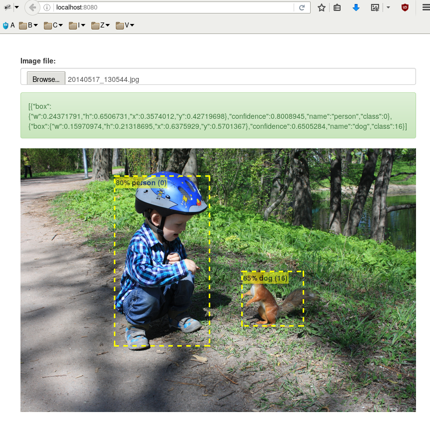

Image Recognition Engine
========================

This is sample HTTP service for object detection using the
[YOLO](https://pjreddie.com/darknet/yolo/) model.
It comes with  simple Web interface.


Requirements
============

IRE is written in Haskell with [GHC](http://www.haskell.org/ghc/).
All required Haskell libraries are listed in [ire.cabal](ire.cabal).
Use [cabal-install](http://www.haskell.org/haskellwiki/Cabal-Install)
to fetch and build all pre-requisites automatically.

It also uses modified [Darknet library](https://github.com/ip1981/darknet),
which you have to build and install separately.


Installation
============

    $ git clone https://github.com/ip1981/ire.git
    $ cd ire
    $ cabal install --dependencies-only
    $ cabal install --ghc-options="-optl=-Wl,-rpath,$darknet/lib" --extra-include-dirs "$darknet/include" --extra-lib-dirs "$darknet/lib"


Usage
=====

Type `ire --help` to see usage summary:

    Usage:
      ire [options]

    Options:
      -c, --config=FILE        Configuration file [default: ire.yml]

      -r, --rootdir=DIR        Web root directory with static files [default: <cabal datadir>]
      -h, --help               Show this message

    Note:
      The default configuration file is loaded if found,
      otherwise default built-in settings are used.


Configuration
=============

You have to provide network configuration file, weights file and class names.
See [example configuration file](./ire.example.yml) and Darknet source code.


Running
=======

```
$ ire
layer     filters    size              input                output
    0 conv     32  3 x 3 / 1   416 x 416 x   3   ->   416 x 416 x  32
    1 max          2 x 2 / 2   416 x 416 x  32   ->   208 x 208 x  32
    2 conv     64  3 x 3 / 1   208 x 208 x  32   ->   208 x 208 x  64
    3 max          2 x 2 / 2   208 x 208 x  64   ->   104 x 104 x  64
    4 conv    128  3 x 3 / 1   104 x 104 x  64   ->   104 x 104 x 128
    5 conv     64  1 x 1 / 1   104 x 104 x 128   ->   104 x 104 x  64
    6 conv    128  3 x 3 / 1   104 x 104 x  64   ->   104 x 104 x 128
    7 max          2 x 2 / 2   104 x 104 x 128   ->    52 x  52 x 128
    8 conv    256  3 x 3 / 1    52 x  52 x 128   ->    52 x  52 x 256
    9 conv    128  1 x 1 / 1    52 x  52 x 256   ->    52 x  52 x 128
   10 conv    256  3 x 3 / 1    52 x  52 x 128   ->    52 x  52 x 256
   11 max          2 x 2 / 2    52 x  52 x 256   ->    26 x  26 x 256
   12 conv    512  3 x 3 / 1    26 x  26 x 256   ->    26 x  26 x 512
   13 conv    256  1 x 1 / 1    26 x  26 x 512   ->    26 x  26 x 256
   14 conv    512  3 x 3 / 1    26 x  26 x 256   ->    26 x  26 x 512
   15 conv    256  1 x 1 / 1    26 x  26 x 512   ->    26 x  26 x 256
   16 conv    512  3 x 3 / 1    26 x  26 x 256   ->    26 x  26 x 512
   17 max          2 x 2 / 2    26 x  26 x 512   ->    13 x  13 x 512
   18 conv   1024  3 x 3 / 1    13 x  13 x 512   ->    13 x  13 x1024
   19 conv    512  1 x 1 / 1    13 x  13 x1024   ->    13 x  13 x 512
   20 conv   1024  3 x 3 / 1    13 x  13 x 512   ->    13 x  13 x1024
   21 conv    512  1 x 1 / 1    13 x  13 x1024   ->    13 x  13 x 512
   22 conv   1024  3 x 3 / 1    13 x  13 x 512   ->    13 x  13 x1024
   23 conv   1024  3 x 3 / 1    13 x  13 x1024   ->    13 x  13 x1024
   24 conv   1024  3 x 3 / 1    13 x  13 x1024   ->    13 x  13 x1024
   25 route  16
   26 reorg              / 2    26 x  26 x 512   ->    13 x  13 x2048
   27 route  26 24
   28 conv   1024  3 x 3 / 1    13 x  13 x3072   ->    13 x  13 x1024
   29 conv    425  1 x 1 / 1    13 x  13 x1024   ->    13 x  13 x 425
   30 detection
Loading weights from yolo.weights...Done!
INFO: Listening on localhost:8080
DEBUG: [Item {itemClass = 0, itemName = "person", itemConfidence = 0.8008945, itemBox = (0.3574012,0.42719698,0.6506731,0.24371791)},Item {itemClass = 16, itemName = "dog", itemConfidence = 0.6505284, itemBox = (0.6375929,0.5701367,0.21318695,0.15970974)}]
...
```


